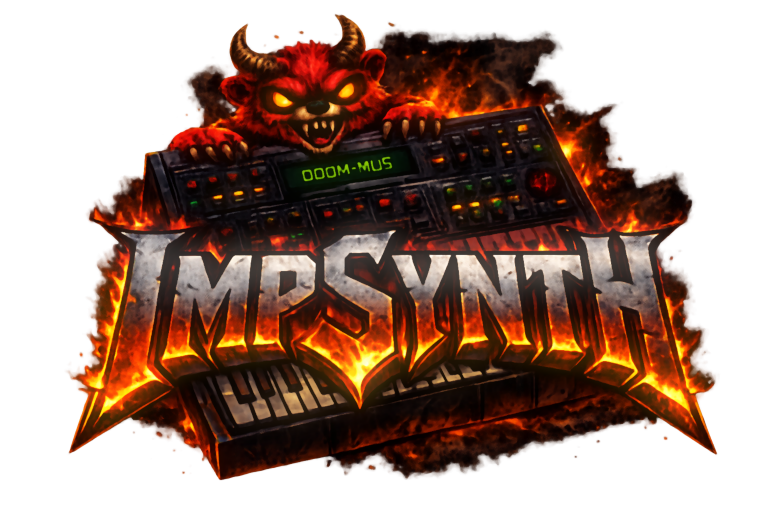

# ImpSynth



[](https://www.youtube.com/watch?v=1Zk8GzTGVV0)

**Demo Song: DOOM: E1M1: Hangar Song: At Doom's Gate on YouTube**

`impsynth` is a small Go OPL3-style FM synth library.

It focuses on the practical DMX/Doom-style register subset:
- 2-op voices
- operator envelopes
- feedback
- waveforms
- stereo pan
- OPL-style register writes

This implementation is based in part on the `Nuked-OPL3` OPL3 emulator by
Nuke.YKT, adapted here into a smaller Go library focused on a subset of OPL3
behavior.

## Install

```bash
go get github.com/Distortions81/impsynth
```

## Usage

```go
package main

import "github.com/Distortions81/impsynth"

func main() {
    opl := impsynth.New(49716)
    opl.Reset()
    opl.WriteReg(0x01, 0x20)
    opl.WriteReg(0x20, 0x21)
    opl.WriteReg(0x23, 0x01)
    opl.WriteReg(0x40, 0x08)
    opl.WriteReg(0x43, 0x00)
    opl.WriteReg(0x60, 0xF2)
    opl.WriteReg(0x63, 0xF2)
    opl.WriteReg(0x80, 0x24)
    opl.WriteReg(0x83, 0x24)
    opl.WriteReg(0xC0, 0x30)
    opl.WriteReg(0xA0, 0x98)
    opl.WriteReg(0xB0, 0x31)

    pcm := opl.GenerateStereoS16(2048)
    _ = pcm
}
```

## API

- `func New(sampleRate int) *Synth`
- `func (*Synth) Reset()`
- `func (*Synth) WriteReg(addr uint16, value uint8)`
- `func (*Synth) GenerateStereoS16(frames int) []int16`
- `func (*Synth) GenerateMonoU8(frames int) []byte`

## Example Program

This repo includes a small renderer that turns a simple melody CSV plus an OPL patch file into a `.wav`:

```bash
go run ./cmd/impsynth-wav-example examples/twinkle.csv twinkle.wav examples/patches/xylophone.json
```

Example render:

- [`impsynth-twinkle.mp3`](impsynth-twinkle.mp3)

The bundled [`examples/twinkle.csv`](examples/twinkle.csv) is the traditional French melody
`Ah! vous dirai-je, maman` (1761), which is in the public domain and is commonly used for
`Twinkle, Twinkle, Little Star`.

The bundled patch at [`examples/patches/xylophone.json`](examples/patches/xylophone.json)
defines a xylophone-like 2-op OPL voice using the same register values you would otherwise
write manually.

CSV format:

```text
start_ms,duration_ms,midi_note
0,500,60
500,500,60
1000,500,67
```

Patch format:

```json
{
  "name": "xylophone",
  "regs": {
    "0x20": 1,
    "0x23": 1,
    "0x40": 24
  }
}
```

## Benchmark

For the cross-check against `Nuked-OPL3`, both implementations use the same
benchmark patch data:

- active voices: `3`
- benchmark remark: this matches the average number of voices active in DOOM
  E1M1
- render size per operation: `2048` stereo `int16` frames
- per-voice register writes: modulator `0x20=0x01`, `0x40=0x18`,
  `0x60=0xF4`, `0x80=0x55`; carrier `0x20=0x01`, `0x40=0x00`,
  `0x60=0xF6`, `0x80=0x14`; channel `0xC0=0x30`, `0xA0=0x98`,
  `0xB0=0x31`
- active channels: `0-2`

Commands:

```bash
go test -bench=BenchmarkGenerateStereoS16_2048Frames -benchmem -benchtime=2048x -run=^$ ./...
go test -bench=BenchmarkGenerateStereoS16_2048Frames_44100Hz -benchmem -benchtime=2048x -run=^$ ./...
go test -bench=BenchmarkGenerateStereoS16_2048Frames_8Voices -benchmem -benchtime=2048x -run=^$ ./...
go test -bench=BenchmarkGenerateStereoS16_2048Frames_8Voices_44100Hz -benchmem -benchtime=2048x -run=^$ ./...
go test -bench=BenchmarkGenerateStereoS16_2048Frames_MaxVoices -benchmem -benchtime=2048x -run=^$ ./...
go test -bench=BenchmarkGenerateStereoS16_2048Frames_MaxVoices_44100Hz -benchmem -benchtime=2048x -run=^$ ./...
./scripts/benchmark-nuked-opl3.sh 2048
./scripts/benchmark-nuked-opl3.sh 2048 44100
./scripts/benchmark-nuked-opl3.sh 2048 49716 8
./scripts/benchmark-nuked-opl3.sh 2048 44100 8
./scripts/benchmark-nuked-opl3.sh 2048 49716 18
./scripts/benchmark-nuked-opl3.sh 2048 44100 18
```

Result on March 13, 2026:

3 voices (`channels 0-2`, checked-in benches):

| Voices | Sample Rate | `ImpSynth` ns/op | `Nuked-OPL3` ns/op | `ImpSynth` Advantage |
| ---: | ---: | ---: | ---: | ---: |
| 3 | 49716 | 221033 | 906457 | `4.10x` faster |
| 3 | 44100 | 240637 | 1017196 | `4.23x` faster |

8 voices (`channels 0-7`, checked-in benches):

| Voices | Sample Rate | `ImpSynth` ns/op | `Nuked-OPL3` ns/op | `ImpSynth` Advantage |
| ---: | ---: | ---: | ---: | ---: |
| 8 | 49716 | 421926 | 946991 | `2.24x` faster |
| 8 | 44100 | 485404 | 1033235 | `2.13x` faster |

18 voices (`channels 0-17`, checked-in benches):

| Voices | Sample Rate | `ImpSynth` ns/op | `Nuked-OPL3` ns/op | `ImpSynth` Advantage |
| ---: | ---: | ---: | ---: | ---: |
| 18 | 49716 | 848318 | 933041 | `1.10x` faster |
| 18 | 44100 | 1007607 | 1039951 | `1.03x` faster |

At a glance:

- At the checked-in 3-voice benchmark, `ImpSynth` is now about `4.1x-4.2x`
  faster than `Nuked-OPL3`.
- At `8` active voices, `ImpSynth` remains comfortably ahead at about
  `2.1x-2.2x`.
- At `18` active voices, the gap is narrow, but `ImpSynth` is still ahead on
  this machine in both native-rate and `44100 Hz` runs.
- The comparison harness now vendors the pinned `Nuked-OPL3` sources under
  `third_party/nuked-opl3`, so these benchmark commands remain runnable even if
  the upstream fetch path changes later.

Why `ImpSynth` is faster:

- `ImpSynth` is a Go-native synth tailored to the subset this repository uses:
  2-op voices, the register patterns driven by the DMX-style patches here, and
  direct stereo PCM generation.
- Its render loop iterates only active channels and drops silent voices from
  the hot path, instead of stepping the full chip model every sample.
- `Nuked-OPL3` is optimized for faithful chip emulation across the broader OPL3
  behavior surface, including timing behavior, write-buffer handling, stereo
  routing details, and other hardware quirks that `ImpSynth` does not attempt
  to reproduce in full.

Legend:

| Field | Meaning |
| --- | --- |
| `Voices` | Active channels used by the benchmark patch. |
| `Sample Rate` | Output sample rate used for the run. |
| `ns/op` | Average nanoseconds per benchmark operation. Here, one operation is one `GenerateStereoS16(2048)` call. |
| `ImpSynth Advantage` | `Nuked-OPL3 ns/op / ImpSynth ns/op` for that row. |

Hardware / software used for the measurement:

- CPU: AMD Ryzen 5 5500U with Radeon Graphics
- OS: Linux 6.8.0-101-generic (Ubuntu)
- Go: go1.25.0 linux/amd64

The vendored `Nuked-OPL3` benchmark dependency comes from commit
`cfedb09efc03f1d7b5fc1f04dd449d77d8c49d50`. Run
`./scripts/fetch-nuked-opl3.sh` only when you want to refresh those checked-in
files from the same pinned upstream revision.

## License

LGPL-2.1

See [`LICENSE`](LICENSE). This repository includes work based in part on
`Nuked-OPL3`.
